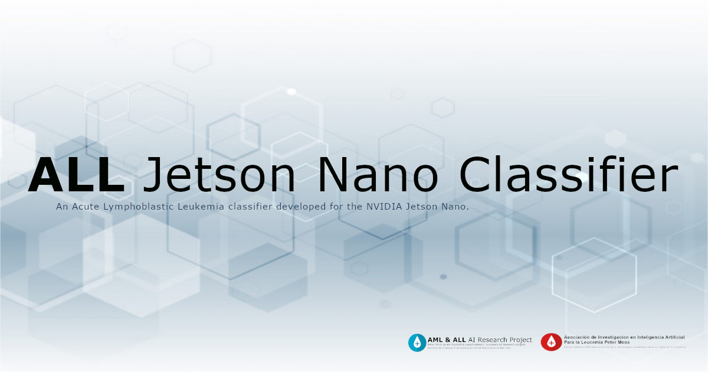

# Peter Moss Acute Myeloid & Lymphoblastic Leukemia AI Research Project
## Acute Lymphoblastic Leukemia Jetson Nano Classifier

    

   

 

&nbsp;

# Table Of Contents

- [Introduction](#introduction)
- [NVIDIA Jetson Nano](#nvidia-jetson-nano)
- [TFRT](#tfrt)
- [ONNX](#onnx)
- [TensorRT](#tensorrt)
- [Motivation](#motivation)
- [DISCLAIMER](#disclaimer)
- [Acute Lymphoblastic Leukemia](#acute-lymphoblastic-leukemia)
- [ALL IDB](#all-idb)
- [Getting Started](#getting-started)
- [Quick Start](#quick-start)
- [Contributing](#contributing)
  - [Contributors](#contributors)
- [Versioning](#versioning)
- [License](#license)
- [Bugs/Issues](#bugs-issues)

&nbsp;

# Introduction

The **Acute Lymphoblastic Leukemia Jetson Nano Classifier** is a Convolutional Neural Network (CNN) developed using [Intel® oneAPI AI Analytics Toolkit](https://software.intel.com/content/www/us/en/develop/tools/oneapi.html) and [Intel® Optimization for Tensorflow*](https://software.intel.com/content/www/us/en/develop/articles/getting-started-with-intel-optimization-of-pytorch.html) to accelerate the training process, and [TensorRT](https://developer.nvidia.com/tensorrt) for high performance inference on the [NVIDIA® Jetson Nano™](https://developer.nvidia.com/embedded/jetson-nano-developer-kit).

In this project you will do the following.

- Train a custom CNN for Acute Lymphoblastic Leukemia on your development machine.
- Convert the Tensorflow SavedModel to TFRT format
- Convert the Tensorflow SavedModel to ONNX format
- Convert the Tensorflow ONNX model to TensorRT format
- Test the CNN on your development machine.
- Download or create a custom docker container for your NVIDIA Jetson Nano.
- Run the CNN on your NVIDIA Jetson Nano using Tensorflow.
- Run the CNN on your NVIDIA Jetson Nano using TFRT.
- Run the CNN on your NVIDIA Jetson Nano using TensorRT.

&nbsp;

# NVIDIA Jetson Nano

The NVIDIA® Jetson Nano™ is a small, powerful computer that is capable of running multiple neural networks in parallel for applications like image classification, object detection, segmentation, and speech processing.

&nbsp;

# TFRT

"TFRT is a new TensorFlow runtime. It aims to provide a unified, extensible infrastructure layer with best-in-class performance across a wide variety of domain specific hardware. It provides efficient use of multithreaded host CPUs, supports fully asynchronous programming models, and focuses on low-level efficiency."

[Source](https://github.com/tensorflow/runtime)

&nbsp;

# ONNX

"ONNX is an open format built to represent machine learning models. ONNX defines a common set of operators - the building blocks of machine learning and deep learning models - and a common file format to enable AI developers to use models with a variety of frameworks, tools, runtimes, and compilers."

[Source](https://onnx.ai/)

&nbsp;

TensorRT

"NVIDIA® TensorRT™ is an SDK for high-performance deep learning inference. It includes a deep learning inference optimizer and runtime that delivers low latency and high throughput for deep learning inference applications."

[Source](https://developer.nvidia.com/tensorrt)

&nbsp;

# Motivation

The motivation behind this project was to test the capabilities of the NVIDIA® Jetson Nano™ for the classification of Acute Lymphoblastic Leukemia on the edge. This project is also a submission for the [NVIDIA Jetson AI Specialist Certification](https://developer.nvidia.com/embedded/learn/jetson-ai-certification-programs).

&nbsp;

# DISCLAIMER

_This project should be used for research purposes only. The purpose of the project is to show the potential of Artificial Intelligence for medical support systems such as diagnostic systems._

_Although the model is accurate and shows good results both on paper and in real world testing, it is trained on a small amount of data and needs to be trained on larger datasets to really evaluate it's accuracy._

_Developers that have contributed to this repository have experience in using Artificial Intelligence for detecting certain types of cancer. They are not doctors, medical or cancer experts._

&nbsp;

# Acute Lymphoblastic Leukemia
[Acute lymphoblastic leukemia (ALL)](https://www.leukemiaairesearch.com/research/leukemia), also known as Acute Lymphocytic Leukemia, is a cancer that affects the lymphoid blood cell lineage. It is the most common leukemia in children, and it accounts for 10-20% of acute leukemias in adults. The prognosis for both adult and especially childhood ALL has improved substantially since the 1970s. The 5- year survival is approximately 95% in children. In adults, the 5-year survival varies between 25% and 75%, with more favorable results in younger than in older patients.

For more information about Acute Lymphoblastic Leukemia  please visit our [Leukemia Information Page](https://www.leukemiaairesearch.com/research/leukemia)

&nbsp;

# ALL-IDB

You need to be granted access to use the Acute Lymphoblastic Leukemia Image Database for Image Processing dataset. You can find the application form and information about getting access to the dataset on [this page](https://homes.di.unimi.it/scotti/all/#download) as well as information on how to contribute back to the project [here](https://homes.di.unimi.it/scotti/all/results.php). If you are not able to obtain a copy of the dataset please feel free to try this tutorial on your own dataset, we would be very happy to find additional AML & ALL datasets.

&nbsp;

# Getting Started

To get started follow the project [documentation](docs/index.md).

&nbsp;

# Quick Start

- [Ubuntu Installation Guide](docs/installation/ubuntu.md)
- [Notebook Usage Guide](docs/usage/notebooks.md)
- [NVIDIA Jetson Nano Installation Guide](docs/installation/jetson.md)
- [NVIDIA Jetson Nano Usage Guide](docs/usage/jetson.md)

&nbsp;

# Contributing
Asociación de Investigacion en Inteligencia Artificial Para la Leucemia Peter Moss encourages and welcomes code contributions, bug fixes and enhancements from the Github community.

Please read the [CONTRIBUTING](https://github.com/AMLResearchProject/Contributing-Guide/blob/main/CONTRIBUTING.md "CONTRIBUTING") document for a full guide to forking our repositories and submitting your pull requests. You will also find our code of conduct in the [Code of Conduct](https://github.com/AMLResearchProject/Contributing-Guide/blob/main/CODE-OF-CONDUCT.md) document.

## Contributors
- [Adam Milton-Barker](https://www.leukemiaairesearch.com/association/volunteers/adam-milton-barker "Adam Milton-Barker") - [Asociación de Investigacion en Inteligencia Artificial Para la Leucemia Peter Moss](https://www.leukemiaresearchassociation.ai "Asociación de Investigacion en Inteligencia Artificial Para la Leucemia Peter Moss") President/Founder & Lead Developer, Sabadell, Spain

&nbsp;

# Versioning
We use [SemVer](https://semver.org/) for versioning.

&nbsp;

# License
This project is licensed under the **MIT License** - see the [LICENSE](LICENSE "LICENSE") file for details.

&nbsp;

# Bugs/Issues
We use the [repo issues](issues "repo issues") to track bugs and general requests related to using this project. See [CONTRIBUTING](CONTRIBUTING.md "CONTRIBUTING") for more info on how to submit bugs, feature requests and proposals.