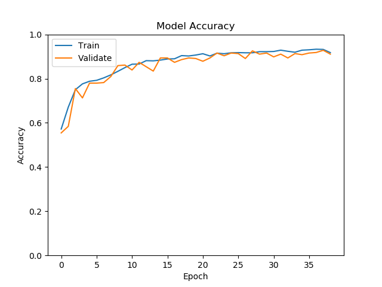
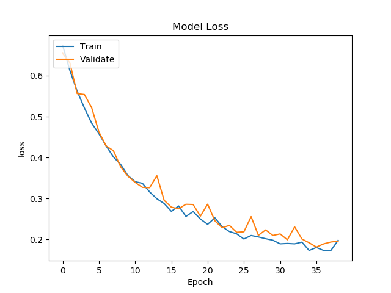
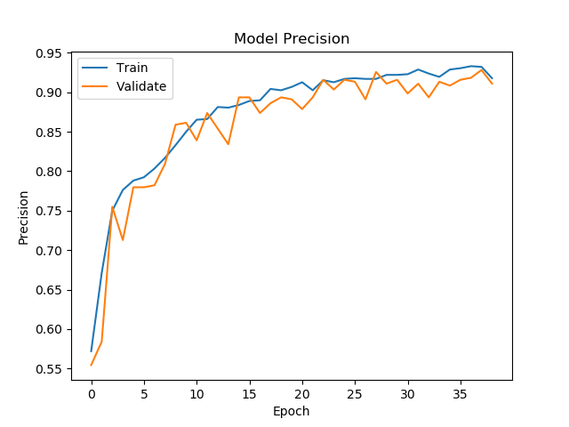
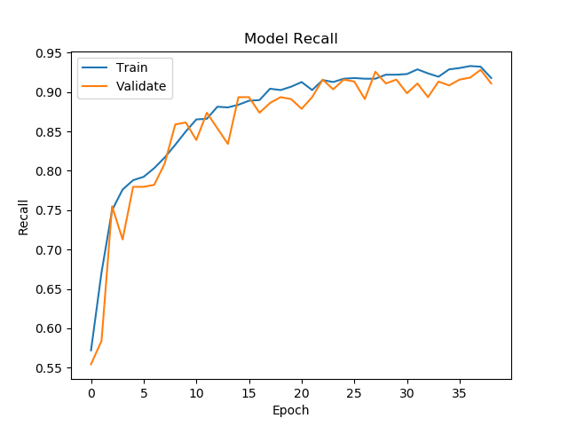
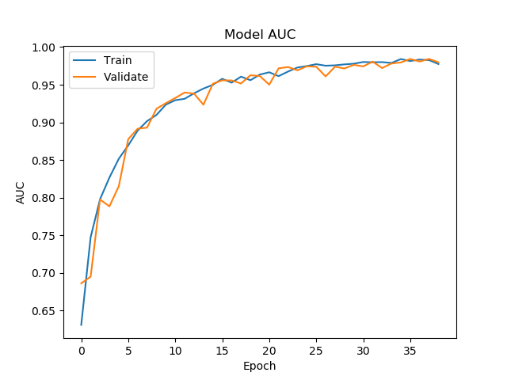
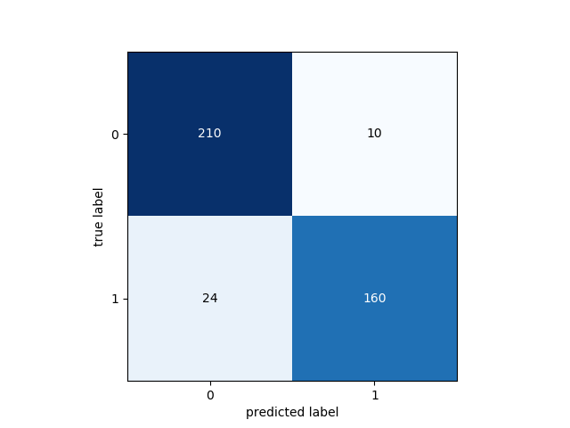

# Python Usage


# Introduction
This guide will take you through the using the **ALL Jetson Nano Classifier** Python trainer to train and test your classifier.

&nbsp;

# Installation
First you need to install the required software for training the model. Below are the available installation guides:

- [Ubuntu installation guide](../installation/ubuntu.md).

&nbsp;

# Network Architecture
We will build a Convolutional Neural Network with the following architecture:

- Average pooling layer
- Conv layer
- Depthwise conv layer
- Flatten layer
- Fully connected layer
- Softmax layer

&nbsp;

# Data
You need to be granted access to use the Acute Lymphoblastic Leukemia Image Database for Image Processing dataset. You can find the application form and information about getting access to the dataset on [this page](https://homes.di.unimi.it/scotti/all/#download) as well as information on how to contribute back to the project [here](https://homes.di.unimi.it/scotti/all/results.php).

_If you are not able to obtain a copy of the dataset please feel free to try this tutorial on your own dataset._

Once you have your data you need to add it to the project filesystem. You will notice the data folder in the Model directory, **model/data**, inside you have **train** & **test**. Add all of the images from the ALL_IDB1 dataset to the **model/data/train** folder.

## Data Augmentation

We will create an augmented dataset based on the [Leukemia Blood Cell Image Classification Using Convolutional Neural Network](http://www.ijcte.org/vol10/1198-H0012.pdf "Leukemia Blood Cell Image Classification Using Convolutional Neural Network") by T. T. P. Thanh, Caleb Vununu, Sukhrob Atoev, Suk-Hwan Lee, and Ki-Ryong Kwon.

## Application testing data

In the data processing stage, ten negative images and ten positive images are removed from the dataset and moved to the **model/data/test/** directory. This data is not seen by the network during the training process, and is used to test the performance of the model.

To ensure your model gets the same results, you should use the same test images. You can also try with your own image selection, however results may vary.

To specify which test images to use modify the [configuration/config.json](../configuration/config.json) file as shown below:

``` json
"test_data": [
    "Im006_1.jpg",
    "Im020_1.jpg",
    "Im024_1.jpg",
    "Im026_1.jpg",
    "Im028_1.jpg",
    "Im031_1.jpg",
    "Im035_0.jpg",
    "Im041_0.jpg",
    "Im047_0.jpg",
    "Im053_1.jpg",
    "Im057_1.jpg",
    "Im060_1.jpg",
    "Im063_1.jpg",
    "Im069_0.jpg",
    "Im074_0.jpg",
    "Im088_0.jpg",
    "Im095_0.jpg",
    "Im099_0.jpg",
    "Im101_0.jpg",
    "Im106_0.jpg"
],
```

&nbsp;

# Configuration

All configuration can be found in the **configuration/config.json** file.

``` json
{
    "agent": {
        "cores": 8,
        "port": 1234,
        "params": [
            "train",
            "classify",
            "server",
            "classify_http",
            "classify_tfrt",
            "classify_tensorrt"
        ]
    },
    "data": {
        "dim": 100,
        "file_type": ".jpg",
        "labels": [0, 1],
        "rotations": 10,
        "seed": 2,
        "split": 0.255,
        "test": "model/data/test",
        "test_data": [
            "Im006_1.jpg",
            "Im020_1.jpg",
            "Im024_1.jpg",
            "Im026_1.jpg",
            "Im028_1.jpg",
            "Im031_1.jpg",
            "Im035_0.jpg",
            "Im041_0.jpg",
            "Im047_0.jpg",
            "Im053_1.jpg",
            "Im057_1.jpg",
            "Im060_1.jpg",
            "Im063_1.jpg",
            "Im069_0.jpg",
            "Im074_0.jpg",
            "Im088_0.jpg",
            "Im095_0.jpg",
            "Im099_0.jpg",
            "Im101_0.jpg",
            "Im106_0.jpg"
        ],
        "train_dir": "model/data/train",
        "valid_types": [
            ".jpg"
        ]
    },
    "model": {
        "model": "model/all_jetson_nano.json",
        "weights": "model/all_jetson_nano.h5",
        "saved": "model/saved",
        "tfrt": "model/tfrt",
        "onnx": "model/all_jetson_nano.onnx",
        "tensorrt": "model/all_jetson_nano.plan"
    },
    "train": {
        "batch": 100,
        "decay_adam": 1e-6,
        "epochs": 150,
        "learning_rate_adam": 1e-4,
        "val_steps": 10
    }
}
```

You should update the following values:

- **agent->cores** Should represent the amount of cores your CPU has.
- **agent->port** Should be the port you will run your test server on.

You can modify the values in the train object as required, however to ensure you achieve the same results you can leave them as they are.

# Training
Now you are ready to train your model.

## Metrics
We can use metrics to measure the effectiveness of our model. In this network you will use the following metrics:

```
tf.keras.metrics.BinaryAccuracy(name='accuracy'),
tf.keras.metrics.Precision(name='precision'),
tf.keras.metrics.Recall(name='recall'),
tf.keras.metrics.AUC(name='auc')
```

These metrics will be displayed and plotted once our model is trained.  A useful tutorial while working on the metrics was the [Classification on imbalanced data](https://www.tensorflow.org/tutorials/structured_data/imbalanced_data) tutorial on Tensorflow's website.

## Start Training
Ensuring you have completed all previous steps, you can start training using the following command.

``` bash
python classifier.py train
```

This tells the application to start training the model.

## Training Data
First the training and validation data will be prepared.

``` bash
2021-08-19 19:27:18,023 - Classifier - INFO - Augmented data size: 1584
2021-08-19 19:27:18,024 - Classifier - INFO - Negative data size: 882
2021-08-19 19:27:18,024 - Classifier - INFO - Positive data size: 702
2021-08-19 19:27:18,024 - Classifier - INFO - Augmented data shape: (1584, 100, 100, 3)
2021-08-19 19:27:18,024 - Classifier - INFO - Labels shape: (1584, 2)
2021-08-19 19:27:18,083 - Classifier - INFO - Training data: (1180, 100, 100, 3)
2021-08-19 19:27:18,083 - Classifier - INFO - Training labels: (1180, 2)
2021-08-19 19:27:18,083 - Classifier - INFO - Validation data: (404, 100, 100, 3)
2021-08-19 19:27:18,083 - Classifier - INFO - Validation labels: (404, 2)
```

### Model Summary

Before the model begins training, you will be shown the model summary.

``` bash
Model: "AllJetsonNano"
_________________________________________________________________
Layer (type)                 Output Shape              Param #
=================================================================
average_pooling2d (AveragePo (None, 50, 50, 3)         0
_________________________________________________________________
conv2d (Conv2D)              (None, 46, 46, 30)        2280
_________________________________________________________________
depthwise_conv2d (DepthwiseC (None, 17, 17, 30)        27030
_________________________________________________________________
flatten (Flatten)            (None, 8670)              0
_________________________________________________________________
dense (Dense)                (None, 2)                 17342
_________________________________________________________________
softmax (Activation)         (None, 2)                 0
=================================================================
Total params: 46,652
Trainable params: 46,652
Non-trainable params: 0
_________________________________________________________________
2021-08-19 19:27:18,162 - Classifier - INFO - Network initialization complete.
2021-08-19 19:27:18,162 - Classifier - INFO - Using Adam Optimizer.
2021-08-19 19:27:18,162 - Classifier - INFO - Using Early Stopping.
```

## Training Results
Below are the training results for 28 epochs.



_Fig 1. Accuracy_



_Fig 2. Loss_



_Fig 3. Precision_



_Fig 4. Recall_



_Fig 5. AUC_



_Fig 6. Confusion Matrix_


``` bash
2021-08-19 19:32:06,527 - Classifier - INFO - Metrics: acc 0.9158415794372559
2021-08-19 19:32:06,527 - Classifier - INFO - Metrics: precision 0.9158415794372559
2021-08-19 19:32:06,527 - Classifier - INFO - Metrics: recall 0.9158415794372559
2021-08-19 19:32:06,527 - Classifier - INFO - Metrics: auc 0.984254002571106
2021-08-19 19:32:07,191 - Classifier - INFO - Confusion Matrix: [[210  10] [ 24 160]]
2021-08-19 19:32:07,307 - Classifier - INFO - True Positives: 160(39.603960396039604%)
2021-08-19 19:32:07,307 - Classifier - INFO - False Positives: 10(2.4752475247524752%)
2021-08-19 19:32:07,307 - Classifier - INFO - True Negatives: 210(51.98019801980198%)
2021-08-19 19:32:07,307 - Classifier - INFO - False Negatives: 24(5.9405940594059405%)
2021-08-19 19:32:07,307 - Classifier - INFO - Specificity: 0.9545454545454546
2021-08-19 19:32:07,307 - Classifier - INFO - Misclassification: 34(8.415841584158416%)
```

## Metrics Overview
| Accuracy | Recall | Precision | AUC/ROC |
| ---------- | ---------- | ---------- | ---------- |
| 0.9158415794372559 | 0.9158415794372559 | 0.9158415794372559 | 0.984254002571106 |

## Figures Of Merit
| Figures of merit     | Amount/Value | Percentage |
| -------------------- | ----- | ---------- |
| True Positives       | 160 | 39.603960396039604% |
| False Positives      | 10 | 2.4752475247524752% |
| True Negatives       | 210 | 51.98019801980198% |
| False Negatives      | 24 | 5.9405940594059405% |
| Misclassification    | 34 | 8.415841584158416% |
| Sensitivity / Recall | 0.9158415794372559   | 92% |
| Specificity          | 0.9545454545454546  | 96% |

&nbsp;

# Testing Tensorflow Model

Now you will test the Intel Optimized Tensorflow model on your training machine. You will use the 20 images that were removed from the training data in the previous part of this tutorial.

To run the classifier in test mode use the following command:

```
python3 classifier.py classify
```

You should see the following which shows you the network architecture:

```
Model: "AllJetsonNano"
_________________________________________________________________
Layer (type)                 Output Shape              Param #
=================================================================
average_pooling2d (AveragePo (None, 50, 50, 3)         0
_________________________________________________________________
conv2d (Conv2D)              (None, 46, 46, 30)        2280
_________________________________________________________________
depthwise_conv2d (DepthwiseC (None, 17, 17, 30)        27030
_________________________________________________________________
flatten (Flatten)            (None, 8670)              0
_________________________________________________________________
dense (Dense)                (None, 2)                 17342
_________________________________________________________________
softmax (Activation)         (None, 2)                 0
=================================================================
Total params: 46,652
Trainable params: 46,652
Non-trainable params: 0
_________________________________________________________________
```

Finally the application will start processing the test images and the results will be displayed in the console.

```
2021-08-19 20:02:29,901 - Classifier - INFO - Acute Lymphoblastic Leukemia correctly detected (True Positive) in 0.04636073112487793 seconds.
2021-08-19 20:02:29,901 - Classifier - INFO - Loaded test image model/data/test/Im047_0.jpg
2021-08-19 20:02:29,937 - Classifier - INFO - Acute Lymphoblastic Leukemia correctly not detected (True Negative) in 0.03577733039855957 seconds.
2021-08-19 20:02:29,938 - Classifier - INFO - Loaded test image model/data/test/Im026_1.jpg
2021-08-19 20:02:29,984 - Classifier - INFO - Acute Lymphoblastic Leukemia correctly detected (True Positive) in 0.04593682289123535 seconds.
2021-08-19 20:02:29,985 - Classifier - INFO - Loaded test image model/data/test/Im088_0.jpg
2021-08-19 20:02:30,021 - Classifier - INFO - Acute Lymphoblastic Leukemia correctly not detected (True Negative) in 0.036516427993774414 seconds.
2021-08-19 20:02:30,022 - Classifier - INFO - Loaded test image model/data/test/Im095_0.jpg
2021-08-19 20:02:30,069 - Classifier - INFO - Acute Lymphoblastic Leukemia correctly not detected (True Negative) in 0.04674267768859863 seconds.
2021-08-19 20:02:30,070 - Classifier - INFO - Loaded test image model/data/test/Im106_0.jpg
2021-08-19 20:02:30,117 - Classifier - INFO - Acute Lymphoblastic Leukemia correctly not detected (True Negative) in 0.046518564224243164 seconds.
2021-08-19 20:02:30,118 - Classifier - INFO - Loaded test image model/data/test/Im024_1.jpg
2021-08-19 20:02:30,164 - Classifier - INFO - Acute Lymphoblastic Leukemia correctly detected (True Positive) in 0.04618191719055176 seconds.
2021-08-19 20:02:30,165 - Classifier - INFO - Loaded test image model/data/test/Im020_1.jpg
2021-08-19 20:02:30,213 - Classifier - INFO - Acute Lymphoblastic Leukemia correctly detected (True Positive) in 0.04806184768676758 seconds.
2021-08-19 20:02:30,214 - Classifier - INFO - Loaded test image model/data/test/Im057_1.jpg
2021-08-19 20:02:30,276 - Classifier - INFO - Acute Lymphoblastic Leukemia correctly detected (True Positive) in 0.062065839767456055 seconds.
2021-08-19 20:02:30,277 - Classifier - INFO - Loaded test image model/data/test/Im063_1.jpg
2021-08-19 20:02:30,328 - Classifier - INFO - Acute Lymphoblastic Leukemia correctly detected (True Positive) in 0.051260948181152344 seconds.
2021-08-19 20:02:30,329 - Classifier - INFO - Loaded test image model/data/test/Im069_0.jpg
2021-08-19 20:02:30,373 - Classifier - INFO - Acute Lymphoblastic Leukemia correctly not detected (True Negative) in 0.04395794868469238 seconds.
2021-08-19 20:02:30,373 - Classifier - INFO - Loaded test image model/data/test/Im101_0.jpg
2021-08-19 20:02:30,409 - Classifier - INFO - Acute Lymphoblastic Leukemia correctly not detected (True Negative) in 0.03528141975402832 seconds.
2021-08-19 20:02:30,409 - Classifier - INFO - Loaded test image model/data/test/Im060_1.jpg
2021-08-19 20:02:30,445 - Classifier - INFO - Acute Lymphoblastic Leukemia correctly detected (True Positive) in 0.0352783203125 seconds.
2021-08-19 20:02:30,445 - Classifier - INFO - Loaded test image model/data/test/Im031_1.jpg
2021-08-19 20:02:30,481 - Classifier - INFO - Acute Lymphoblastic Leukemia correctly detected (True Positive) in 0.035286664962768555 seconds.
2021-08-19 20:02:30,481 - Classifier - INFO - Loaded test image model/data/test/Im006_1.jpg
2021-08-19 20:02:30,529 - Classifier - INFO - Acute Lymphoblastic Leukemia correctly detected (True Positive) in 0.04689455032348633 seconds.
2021-08-19 20:02:30,529 - Classifier - INFO - Loaded test image model/data/test/Im099_0.jpg
2021-08-19 20:02:30,576 - Classifier - INFO - Acute Lymphoblastic Leukemia correctly not detected (True Negative) in 0.046888113021850586 seconds.
2021-08-19 20:02:30,577 - Classifier - INFO - Loaded test image model/data/test/Im035_0.jpg
2021-08-19 20:02:30,624 - Classifier - INFO - Acute Lymphoblastic Leukemia correctly not detected (True Negative) in 0.04698944091796875 seconds.
2021-08-19 20:02:30,625 - Classifier - INFO - Loaded test image model/data/test/Im028_1.jpg
2021-08-19 20:02:30,673 - Classifier - INFO - Acute Lymphoblastic Leukemia correctly detected (True Positive) in 0.04763507843017578 seconds.
2021-08-19 20:02:30,673 - Classifier - INFO - Loaded test image model/data/test/Im074_0.jpg
2021-08-19 20:02:30,732 - Classifier - INFO - Acute Lymphoblastic Leukemia correctly not detected (True Negative) in 0.058196306228637695 seconds.
2021-08-19 20:02:30,732 - Classifier - INFO - Images Classified: 20
2021-08-19 20:02:30,732 - Classifier - INFO - True Positives: 10
2021-08-19 20:02:30,732 - Classifier - INFO - False Positives: 0
2021-08-19 20:02:30,732 - Classifier - INFO - True Negatives: 10
2021-08-19 20:02:30,732 - Classifier - INFO - False Negatives: 0
2021-08-19 20:02:30,732 - Classifier - INFO - Total Time Taken: 1.1011667251586914
```

# Testing TFRT Model

Now you will test the TFRT model on your training machine:

``` bash
python3 classifier.py classify_tfrt
```

You will see the following output:

``` bash
2021-08-19 20:05:40,637 - Classifier - INFO - Acute Lymphoblastic Leukemia correctly detected (True Positive) in 0.016054153442382812 seconds.
2021-08-19 20:05:40,638 - Classifier - INFO - Loaded test image model/data/test/Im047_0.jpg
2021-08-19 20:05:40,639 - Classifier - INFO - Acute Lymphoblastic Leukemia correctly not detected (True Negative) in 0.0012242794036865234 seconds.
2021-08-19 20:05:40,640 - Classifier - INFO - Loaded test image model/data/test/Im026_1.jpg
2021-08-19 20:05:40,641 - Classifier - INFO - Acute Lymphoblastic Leukemia correctly detected (True Positive) in 0.0011212825775146484 seconds.
2021-08-19 20:05:40,642 - Classifier - INFO - Loaded test image model/data/test/Im088_0.jpg
2021-08-19 20:05:40,648 - Classifier - INFO - Acute Lymphoblastic Leukemia correctly not detected (True Negative) in 0.00597381591796875 seconds.
2021-08-19 20:05:40,649 - Classifier - INFO - Loaded test image model/data/test/Im095_0.jpg
2021-08-19 20:05:40,651 - Classifier - INFO - Acute Lymphoblastic Leukemia correctly not detected (True Negative) in 0.0020668506622314453 seconds.
2021-08-19 20:05:40,651 - Classifier - INFO - Loaded test image model/data/test/Im106_0.jpg
2021-08-19 20:05:40,654 - Classifier - INFO - Acute Lymphoblastic Leukemia correctly not detected (True Negative) in 0.0019850730895996094 seconds.
2021-08-19 20:05:40,654 - Classifier - INFO - Loaded test image model/data/test/Im024_1.jpg
2021-08-19 20:05:40,656 - Classifier - INFO - Acute Lymphoblastic Leukemia correctly detected (True Positive) in 0.0019817352294921875 seconds.
2021-08-19 20:05:40,657 - Classifier - INFO - Loaded test image model/data/test/Im020_1.jpg
2021-08-19 20:05:40,665 - Classifier - INFO - Acute Lymphoblastic Leukemia correctly detected (True Positive) in 0.007786750793457031 seconds.
2021-08-19 20:05:40,665 - Classifier - INFO - Loaded test image model/data/test/Im057_1.jpg
2021-08-19 20:05:40,667 - Classifier - INFO - Acute Lymphoblastic Leukemia correctly detected (True Positive) in 0.0019440650939941406 seconds.
2021-08-19 20:05:40,668 - Classifier - INFO - Loaded test image model/data/test/Im063_1.jpg
2021-08-19 20:05:40,670 - Classifier - INFO - Acute Lymphoblastic Leukemia correctly detected (True Positive) in 0.0018777847290039062 seconds.
2021-08-19 20:05:40,670 - Classifier - INFO - Loaded test image model/data/test/Im069_0.jpg
2021-08-19 20:05:40,672 - Classifier - INFO - Acute Lymphoblastic Leukemia correctly not detected (True Negative) in 0.0018739700317382812 seconds.
2021-08-19 20:05:40,673 - Classifier - INFO - Loaded test image model/data/test/Im101_0.jpg
2021-08-19 20:05:40,674 - Classifier - INFO - Acute Lymphoblastic Leukemia correctly not detected (True Negative) in 0.001840829849243164 seconds.
2021-08-19 20:05:40,675 - Classifier - INFO - Loaded test image model/data/test/Im060_1.jpg
2021-08-19 20:05:40,677 - Classifier - INFO - Acute Lymphoblastic Leukemia correctly detected (True Positive) in 0.0018241405487060547 seconds.
2021-08-19 20:05:40,677 - Classifier - INFO - Loaded test image model/data/test/Im031_1.jpg
2021-08-19 20:05:40,679 - Classifier - INFO - Acute Lymphoblastic Leukemia correctly detected (True Positive) in 0.0018105506896972656 seconds.
2021-08-19 20:05:40,680 - Classifier - INFO - Loaded test image model/data/test/Im006_1.jpg
2021-08-19 20:05:40,681 - Classifier - INFO - Acute Lymphoblastic Leukemia correctly detected (True Positive) in 0.0018205642700195312 seconds.
2021-08-19 20:05:40,682 - Classifier - INFO - Loaded test image model/data/test/Im099_0.jpg
2021-08-19 20:05:40,684 - Classifier - INFO - Acute Lymphoblastic Leukemia correctly not detected (True Negative) in 0.0018069744110107422 seconds.
2021-08-19 20:05:40,684 - Classifier - INFO - Loaded test image model/data/test/Im035_0.jpg
2021-08-19 20:05:40,686 - Classifier - INFO - Acute Lymphoblastic Leukemia correctly not detected (True Negative) in 0.00182342529296875 seconds.
2021-08-19 20:05:40,687 - Classifier - INFO - Loaded test image model/data/test/Im028_1.jpg
2021-08-19 20:05:40,688 - Classifier - INFO - Acute Lymphoblastic Leukemia correctly detected (True Positive) in 0.0018129348754882812 seconds.
2021-08-19 20:05:40,689 - Classifier - INFO - Loaded test image model/data/test/Im074_0.jpg
2021-08-19 20:05:40,691 - Classifier - INFO - Acute Lymphoblastic Leukemia correctly not detected (True Negative) in 0.001878976821899414 seconds.
2021-08-19 20:05:40,691 - Classifier - INFO - Images Classified: 20
2021-08-19 20:05:40,691 - Classifier - INFO - True Positives: 10
2021-08-19 20:05:40,691 - Classifier - INFO - False Positives: 0
2021-08-19 20:05:40,691 - Classifier - INFO - True Negatives: 10
2021-08-19 20:05:40,691 - Classifier - INFO - False Negatives: 0
2021-08-19 20:05:40,691 - Classifier - INFO - Total Time Taken: 0.11129593849182129
```

&nbsp;

# Preparing For NVIDIA Jetson Nano

After training the model was converted to ONNX format ready to be converted to TensorRT format for usage on the NVIDIA Jetson Nano.

&nbsp;

# Conclusion

Here we trained a deep learning model for Acute Lymphoblastic Leukemia detection utilizing Intel® Optimization for Tensorflow* from the Intel® oneAPI AI Analytics Toolkit to optimize and accelarate training. We introduced a 6 layer deep learning model and applied data augmentation to increase the training data.

We trained our model with a target of 150 epochs and used early stopping to avoid overfitting. The model trained for 37 epochs resulting in a fairly good fit, accuracy/precision/recall and AUC are satisfying. In addition the model reacts well during testing classifying each of the twenty unseen test images correctly.

We see that the TFRT model performs considerably better than the Tensorflow model, improving classification time by 0.98 seconds.

&nbsp;

# Continue

Now you are ready to set up your NVIDIA Jetson Nano. Head over to the [NVIDIA Jetson Nano Installation Guide](../installation/jetson.md) to prepare your Jetson.

&nbsp;

# Contributing
Asociación de Investigacion en Inteligencia Artificial Para la Leucemia Peter Moss encourages and welcomes code contributions, bug fixes and enhancements from the Github community.

Please read the [CONTRIBUTING](https://github.com/AMLResearchProject/Contributing-Guide/blob/main/CONTRIBUTING.md "CONTRIBUTING") document for a full guide to forking our repositories and submitting your pull requests. You will also find our code of conduct in the [Code of Conduct](https://github.com/AMLResearchProject/Contributing-Guide/blob/main/CODE-OF-CONDUCT.md) document.

## Contributors
- [Adam Milton-Barker](https://www.leukemiaairesearch.com/association/volunteers/adam-milton-barker "Adam Milton-Barker") - [Asociación de Investigacion en Inteligencia Artificial Para la Leucemia Peter Moss](https://www.leukemiaresearchassociation.ai "Asociación de Investigacion en Inteligencia Artificial Para la Leucemia Peter Moss") President/Founder & Lead Developer, Sabadell, Spain

&nbsp;

# Versioning
We use [SemVer](https://semver.org/) for versioning.

&nbsp;

# License
This project is licensed under the **MIT License** - see the [LICENSE](https://github.com/AMLResearchProject/ALL-Jetson-Nano-Classifier/blob/main/LICENSE "LICENSE") file for details.

&nbsp;

# Bugs/Issues
We use the [repo issues](https://github.com/AMLResearchProject/ALL-Jetson-Nano/issues "repo issues") to track bugs and general requests related to using this project. See [CONTRIBUTING](https://github.com/AMLResearchProject/Contributing-Guide/blob/main/CONTRIBUTING.md "CONTRIBUTING") for more info on how to submit bugs, feature requests and proposals.